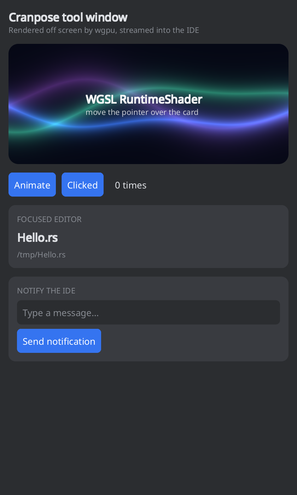

# Cranpose IntelliJ plugin template

Write IntelliJ Platform plugins whose UI is Rust: this template's tool window
is a [Cranpose](https://github.com/samoylenkodmitry/Cranpose) app — Compose-style
declarative UI, drawn by the GPU, WGSL shaders included — and it talks to the
IDE in both directions. Click **Use this template** to start your own plugin.



```
 IDE process (JVM)                          UI process (Rust, one per tool window)
┌──────────────────────────────┐           ┌───────────────────────────────────────┐
│ CranposeToolWindowFactory    │  spawns   │ main.rs → AppLauncher::run_embedded   │
│  ├─ CranposePanel (Swing)    │──────────▶│  Cranpose app, no window of its own   │
│  │   paints BGRA frames      │◀─ frames ─│  draws off screen (Metal/Vulkan/DX12) │
│  │   forwards mouse/keys/size│── input ─▶│  sends only the rectangle that changed│
│  └─ IdeBridge                │           │                                       │
│      theme, focused editor ──│─ messages▶│ rememberHostMessages("ide.theme")     │
│      notifications, open file│◀─messages─│ send_to_host("ide.notify", json)      │
└──────────────────────────────┘ loopback  └───────────────────────────────────────┘
                                 TCP + one-time token
```

- **Crash-isolated.** The UI runs in its own process: a panic or a GPU driver
  fault shows "Cranpose stopped — click to restart" instead of taking the IDE
  down.
- **No JNI, no unsafe.** The UI is an ordinary Cranpose binary; the plugin is
  plain Kotlin and Swing.
- **Cheap when idle.** Frames are sent only when pixels change, and only the
  rectangle that changed; a hidden tool window stops the UI's frame loop until
  it is shown again. The loop is paced to the display's refresh rate and waits
  for the panel to acknowledge frames before drawing more.
- **Hot reload.** Point the IDE at your debug build and the tool window
  restarts the UI every time `cargo build` replaces it.
- **Runs standalone too.** Started without the IDE, the same binary opens a
  desktop window, so `cargo run` is the fastest way to work on the UI.
- **Every desktop platform.** CI builds the UI for macOS, Linux and Windows on
  both aarch64 and x86_64 and bundles all six into one plugin.

## Layout

| Path | What it is |
|---|---|
| `ui/src/tool_window.rs` | The screen. Start here. |
| `ui/src/aurora.rs` | The WGSL shader card. |
| `ui/src/ide.rs` | The message contract, Rust side. |
| `ui/src/main.rs` | Runs the UI in the IDE or as a desktop window; leave it as it is. |
| `plugin/src/main/kotlin/.../IdeBridge.kt` | The message contract, IDE side. |
| `plugin/src/main/kotlin/.../CranposePanel.kt` | The Swing component that shows the UI and forwards input. It knows nothing about IntelliJ. |
| `plugin/src/main/kotlin/.../CranposeSession.kt`, `CranposeProtocol.kt` | The process, the socket and the wire codec. |
| `plugin/src/main/kotlin/.../UiBinary.kt` | Finds the UI binary: your dev build, or the one bundled for this OS and CPU. |
| `plugin/src/main/resources/META-INF/plugin.xml` | Plugin id, name and the tool window. |

## Run it

The UI alone, as a desktop window:

```bash
cargo run -p cranpose-intellij-ui
```

The plugin in a sandbox IDE (Gradle needs a JDK 17 or newer to start, and
downloads the JDK 21 the build uses when none is installed):

```bash
cd plugin
./gradlew runIde
```

Without further options Gradle downloads the IDE named by `platformVersion`
in `plugin/gradle.properties`. Add
`-PplatformLocalPath="/Applications/IntelliJ IDEA.app"` to use an installed
IntelliJ-platform IDE of 2026.1 or later instead (IntelliJ IDEA, RustRover,
Android Studio, …), and `-PrunIdeProject=<dir>` to open a project on start.
`runIde` builds the UI in release mode and bundles it.

### Hot reload

```bash
cd plugin
./gradlew runIde -PcranposeUiBinary="$PWD/../target/debug/cranpose-intellij-ui"
```

and, after each edit, in another terminal:

```bash
cargo build -p cranpose-intellij-ui --no-default-features
```

An installed IDE does the same with `CRANPOSE_UI_BINARY` in its environment or
`-Dcranpose.ui.binary=` in its VM options.

### Test

```bash
cargo test -p cranpose-intellij-ui
cd plugin && ./gradlew test
```

`EmbeddedUiEndToEndTest` plays the IDE against the real release binary: it
checks the themed first frame, that the shader animates only its own card,
that the Pause button stops the frames, that a new editor file repaints only
the editor card, and that the Send button reaches the IDE as `ide.notify`. It
saves what it saw to `plugin/build/test-frames/`. It needs a GPU or a software
Vulkan driver (`mesa-vulkan-drivers` on Linux, which CI installs).

## Make it yours

1. Rename the plugin id, name, vendor and tool window in
   `plugin/src/main/resources/META-INF/plugin.xml`, and the Kotlin package.
2. To rename the binary, change it in `ui/Cargo.toml`, `UiBinary.NAME`,
   `plugin/build.gradle.kts` and `.github/workflows/build.yml`.
3. Write your UI in `ui/src`.
4. Add channels. Rust sends with `send_to_host(channel, payload)` and receives
   with `rememberHostMessages(channel)`; Kotlin sends with
   `panel.send(channel, payload)` and receives in `panel.onAppMessage`. The
   newest message of each channel is replayed to a screen that starts
   collecting late, so state channels (theme, selection) need no handshake.

## Channels in this template

| Channel | Direction | Payload |
|---|---|---|
| `ide.theme` | IDE → UI | `{"dark","background","surface","text","muted","accent"}`, colors as `#rrggbb`; sent on connect and on every theme change |
| `ide.editor` | IDE → UI | `{"path","name"}` of the focused editor, `{}` when none |
| `ide.notify` | UI → IDE | `{"title","content"}`: a balloon notification |
| `ide.open` | UI → IDE | `{"path"}`: open the file in an editor |

## Build and release for every platform

The plugin looks for its UI at `/native/<os>-<arch>/cranpose-intellij-ui[.exe]`
inside its jar (`<os>`: `macos`, `linux`, `windows`; `<arch>`: `aarch64`,
`x86_64`) and copies it to the IDE's system directory under a content hash on
first use.

- A local `./gradlew buildPlugin` bundles the build for the machine it runs on.
- The **Build** workflow builds all six binaries, runs the tests on Linux, and
  uploads a `plugin` artifact that runs everywhere. Locally, the same comes from
  `./gradlew buildPlugin -PcranposeNativeDir=<dir>` with one
  `<os>-<arch>/` folder per platform.
- Pushing a `v*` tag attaches that zip to a GitHub release. With the
  `PUBLISH_TOKEN` secret set (plus `CERTIFICATE_CHAIN`, `PRIVATE_KEY` and
  `PRIVATE_KEY_PASSWORD` for [plugin signing](https://plugins.jetbrains.com/docs/intellij/plugin-signing.html))
  it also publishes to JetBrains Marketplace. Set `pluginVersion` in
  `plugin/gradle.properties` to the tag's version first.
- The **Cranpose main** workflow runs the tests nightly against Cranpose's
  main branch, so a framework change that affects the template shows up before
  it is released. Dependabot proposes Cranpose version bumps.

Machines without Vulkan (some Linux VMs) can enable `cranpose`'s
`renderer-wgpu-gles` feature in `ui/Cargo.toml` for a GL fallback.

## Wire protocol

The framework side is Cranpose's `embed` feature (`cranpose::embed`); this
template's `CranposeProtocol.kt` mirrors it. Little-endian, one message per
`u32` length prefix, then a kind byte and its fields; strings are a `u32` byte
length and UTF-8. The UI connects to `CRANPOSE_EMBED_ADDRESS` and must first
send Hello with `CRANPOSE_EMBED_TOKEN`; the plugin drops any other connection.

| Kind | UI → IDE | Fields |
|---|---|---|
| `0x01` | Hello | `u32` version, `str` token |
| `0x02` | Frame | `u32` id, `u32` buffer width, `u32` buffer height, `u32` x, y, width, height, then width×height BGRA premultiplied pixels |
| `0x03` | Cursor | `str` CSS cursor name |
| `0x04` | Message | `str` channel, `str` payload |

| Kind | IDE → UI | Fields |
|---|---|---|
| `0x01` | Resize | `u32` width, `u32` height (physical pixels), `f32` scale, `f32` refresh Hz |
| `0x02`–`0x04` | Pointer move / down / up | `f32` x, `f32` y (logical pixels) |
| `0x05` | Pointer leave | — |
| `0x06` | Scroll | `f32` x, y, `f32` dx, dy (logical pixels, positive moves content down/right), `u8` modifiers |
| `0x07` | Key | `u8` down, `u8` modifiers, `str` W3C `KeyboardEvent.code` |
| `0x08` | Text | `str` committed text |
| `0x09` | Theme | `u8` dark |
| `0x0A` | Message | `str` channel, `str` payload |
| `0x0B` | Frame ack | `u32` frame id |
| `0x0C` | Close | — |
| `0x0D` | Visibility | `u8` visible |

Modifier bits: shift `1`, ctrl `2`, alt `4`, meta `8`. Unknown kinds are
skipped, so either side can add messages without breaking the other; Hello's
version changes when an existing message does.

## Not covered yet

- IME composition text is not shown while composing (committed text arrives).
- Shortcuts the IDE binds (⌘C, ⌘V, Escape, …) are handled by the IDE before
  the panel sees them.
- The IDE's screen reader does not see the Cranpose semantics tree.
- Each tool window runs its own process with its own GPU device.
- Frames travel through a CPU readback and a socket; at 60 fps a card-sized
  animation costs the UI process about 16% of one core on an M-series Mac.

## License

Apache-2.0, like Cranpose.
