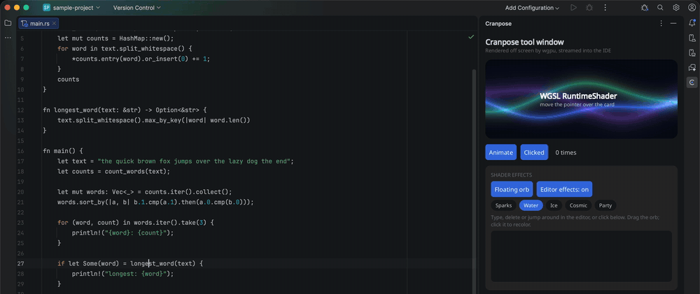

# Cranpose IntelliJ plugin template

Build an IntelliJ Platform plugin in Rust, with its UI drawn by
[Cranpose](https://github.com/samoylenkodmitry/Cranpose).
For developing Cranpose applications, use [Cranpose for IntelliJ IDEA](https://github.com/samoylenkodmitry/cranpose-idea).



The UI, native IDE host, build tools, integration tests and release tools are Rust.
Rust generates the small JVM extension classes that IntelliJ requires. There is no
authored Java or Kotlin and no Gradle build. IntelliJ itself still supplies its JVM
and platform APIs.

## Architecture

The shared Rust host calls the IntelliJ SDK through JNI. A separate Cranpose process
draws the UI and sends BGRA frames over an authenticated loopback connection. The
host displays those pixels and forwards mouse, keyboard, scale and visibility events.

- The UI process is isolated from the IDE. Click a stopped surface to restart it.
- Dirty rectangles, frame acknowledgements and visibility control keep idle work low.
- The same Cranpose UI runs in a tool window or a standalone desktop window.
- Editor overlays and transparent floating windows use Cranpose surfaces.
- A debug UI binary restarts after Cargo replaces it and the file settles.
- CI packages the native host and UI for macOS, Linux and Windows, on both ARM64 and x86-64.

## Develop

Run the UI as a desktop window:

```bash
cargo run -p cranpose-intellij-ui
```

Build an installable plugin for the current machine:

```bash
cargo run -p cranpose-template-tools -- package
```

Install the resulting ZIP from `target/plugin/` using **Settings → Plugins → Install
Plugin from Disk**, then restart the IDE. Supported platform baseline: 2026.1.

For fast UI iteration, add this VM option to your development IDE:

```text
-Dcranpose.ui.binary=/absolute/path/to/target/debug/cranpose-intellij-ui
```

Then run `cargo build -p cranpose-intellij-ui --no-default-features` after UI edits.
The host watches the binary and restarts its UI automatically. Host changes require
repackaging and restarting the IDE.

## Layout

| Path | Purpose |
|---|---|
| `ui/src/tool_window.rs` | Cranpose tool window |
| `ui/src/effects.rs`, `effects.wgsl` | Five editor effect styles |
| `ui/src/orb.rs` | Draggable transparent shader window |
| `ui/src/ide.rs` | JSON channel contract |
| `host/src/lib.rs` | Rust JNI entry point and optional custom host messages |
| `xtask/src/main.rs` | Plugin identity and shared Rust build tools |
| `plugin/src/main/resources/META-INF/plugin.xml` | SDK extension registration |
| `plugin/VERSION` | Plugin release version |

The reusable SDK is owned by this template. The example plugin uses local SDK crates;
[Cranpose Studio](https://github.com/samoylenkodmitry/cranpose-idea) pins these same
crates from this repository. There is no dependency back on Studio.

| Shared crate | Purpose |
|---|---|
| `sdk/host` | JNI dispatch, native surfaces, lifecycle, editor and project integration |
| `sdk/jvm-bridge` | JVM classfile generation in Rust |
| `sdk/tools` | Packaging, SDK tests, native verification and release tools |
| `sdk/ux` | Themes, searchable trees and change-only host message delivery |
| `sdk/cache` | [Generated assets and private dependency caches](sdk/cache/README.md) |
| `sdk/process` | [Owned process trees, bounded shutdown and cancellation](sdk/process/README.md) |
| `sdk/watch` | Bounded, deduplicated file-change batches with quiet and maximum deadlines |

The template disables Cargo project and stability features; applications opt in
through `HostFeatures`. Plugin identity and checkout paths are explicit in each
application's build entry point, so tools cannot accidentally package their SDK checkout.
The UX crate has no Cranpose version dependency: its colors are converted at the
UI boundary, and nightly framework compatibility checks still use one framework.

`ChangeQueue` accepts already-filtered keys from a watcher callback. Repeated keys
share one entry. A quiet period groups atomic saves; a maximum deadline prevents
continuous edits from starving the consumer. Overflow or lost events invalidate
the whole batch so the application can require a restart instead of applying
incomplete changes. The crate uses only the Rust standard library.

The shared `hot-smoke` tool can record `--measure-rounds N --report timings.json`.
It measures source-save to runtime acknowledgement and to a matching inspector
snapshot, while checking application PID, remembered state and error recovery.
It also records shutdown latency and verifies that the runner, compiler and application exited.
`--background-noise-ms N` writes ignored build output during fixture measurements.
Snapshot observation has a 200 ms polling interval; acknowledgement timestamps
are captured by the socket reader. Keep benchmarks separate from other builds.
`--startup-only` stops after the first matching preview snapshot without editing
source. `--idle-seconds N` measures each preview process with the surface visible,
inspecting every 500 ms, and hidden; reports include frames, requests and CPU time
as a percentage of one core. CPU sampling currently uses `ps` on macOS/Linux,
with 10 ms/1 second clock resolution respectively. Short intervals cannot resolve
small CPU changes. These measurements cover the isolated preview processes, not
the entire IDE or Studio tool window.
`--build-diagnostics --require-cached-support` verifies a warm restart reuses both
generated support crates; the first launch after a support change must warm them.
When the log includes Cargo's rounded `Finished` timing, `cargoReportedBuildMs`
records that phase separately from launch-to-first-snapshot `startupMs`. It is
null when Cargo's log format provides no recognizable timing.
`--reuse-fixture` keeps a fixture's source path stable across clean runs, using an
exclusive workspace lease. On the second launch, `--require-cached-workspace`
asserts that the runner reused its private workspace too. Give each compared
runner its own warm cache: sharing a Cargo output directory lets one variant
replace the other's incremental artifacts and confounds restart measurements.

## Make it yours

1. Change the ID, display name, vendor and tool-window name in `plugin.xml`.
2. Set the same plugin ID in `xtask/src/main.rs` and choose your package directory name.
3. Write your composables in `ui/src/`.
4. Add host channels in Rust; see [Extending the host](docs/extending-the-host.md).
5. Set `plugin/VERSION` before creating a release.

Keep the native library and UI executable names unless you also extend the shared
packager and binary locator.

## Test and release

```bash
cargo fmt --all --check
cargo clippy --workspace --all-targets -- -D warnings
cargo test --workspace
cargo run -p cranpose-template-tools -- release audit-source
cargo run -p cranpose-template-tools -- ide-test --ide "/Applications/IntelliJ IDEA.app"
```

The integration suite launches a separate headless IDEA, loads the generated JVM
classes and native host, checks project lifecycle and pixel updates, and renders
the real Cranpose UI. Evidence is saved under `target/ide-tests/`. Linux needs
`mesa-vulkan-drivers`. An isolated RustRover test installation requires its own license;
use IDEA for headless tests.

The **Build** workflow compiles all six platforms, runs Rust and native IDE tests,
assembles the ZIP and runs JetBrains Plugin Verifier against IDEA and RustRover.
The nightly **Cranpose main** workflow runs the same integration suite against the
framework's current main branch.

The **Publish** workflow is manual. It requires a matching version tag and an already
successful Build for that exact commit. It downloads the verified ZIP, signs it,
and uploads it to the numeric Marketplace plugin ID you supply. Configure
`PUBLISH_TOKEN`, `CERTIFICATE_CHAIN`, `PRIVATE_KEY` and `PRIVATE_KEY_PASSWORD`.
For a new Marketplace listing, upload the first ZIP manually and then use its ID.

## Messages and effects

| Channel | Direction | Content |
|---|---|---|
| `ide.theme` | Host → UI | IDE palette and dark mode |
| `ide.editor` | Host → UI | Selected file path and name |
| `ide.caret` | Host → UI | Typing, deletion or movement, with caret coordinates |
| `ide.notify` | UI → host | Notification title and content |
| `ide.open` | UI → host | File path |
| `host.overlay` | UI → host | Cranpose overlay declaration |

Send with `cranpose::send_to_host` and receive with `rememberHostMessages`.
`HostOverlay("editor")` places a transparent, input-free surface over the selected
editor. `Modifier::window` opens an IDE-owned surface; `window_drag_area` makes the
floating orb draggable.

The included styles are sparks, water, ice, cosmic and party. Each has effects for
typing, deletion and caret movement. Add an `EffectKind` and a WGSL case to extend
them. WGSL remains the GPU shader language; application and tooling code is Rust.

[Full-quality effects video](docs/effects.mp4) · [Effect reference image](docs/effects.png)

## Credits

Built with Cranpose and the IntelliJ Platform SDK. Apache-2.0.

## Measuring Studio inspection and Restart

The shared Rust tools include two optional performance probes:

- `hot-smoke --startup-only --restart-rounds 5` starts each replacement while its predecessor is alive, requests a fresh response from the old preview, then verifies its runner, compiler and application have exited. Reports include each startup phase, private workspace path and Cargo build time. The harness keeps the predecessor through the first snapshot; the IDE switches at connection.
- `inspection-profile --binary /path/to/studio-ui --nodes 1000 --seconds 20 --settle-seconds 5 --log inspector.log --report inspector.json` sends unchanged layouts through the real embedded protocol, records visible and hidden UI CPU, and verifies a changed layout appears. CPU sampling currently requires macOS or Linux. It excludes application capture, IDE/JNI work and the measurement host. `--require-quiet` checks that settled unchanged layouts produce no frames; it is not a CPU threshold.

Both probes use owned processes and bounded shutdown. Studio runs them in CI.
`delivery::SequenceGate` shares the accepted revision across UI model clones, so
discarding an equal model cannot allow an older asynchronous reply to replace it.

`viewport::RowWindow` limits fixed-height Cranpose lists to visible rows plus
overscan. Put its `before` and `after` spacers around the returned range and read
reactive scroll state at the call site. Rows must have the declared height;
clamp the stored scroll offset when filtering shrinks the content.

`inspection-profile --change-rounds 10 --exercise-tree --max-ui-nodes 200`
also verifies real changed labels, scrolling to the final row, collapse while
scrolled, expansion and return to the first row. The node budget checks that a
large inspector composes a bounded UI. Timings include JSON transport and the
UI inspector acknowledgement (polled every 20 ms); they are not frame times.
Initial and changed-layout CPU samples cover the Studio UI process only.

Use `--change-seconds 20` to sample CPU while changing every node label every
500 ms. This interval sends no UI-inspection requests; the last changed label is
verified afterward. This separates normal update work from the acknowledgement
cost included in the per-round latency measurements.

### Compiler identity during overlapping previews

`WorkspaceLease::stage_executable` gives a self-contained compiler tool a stable
path per lease. It uses a hard link, or copies across filesystems with executable
permissions preserved. Stage before starting users; keep the source immutable
while they run. Only call `complete` after every descendant has exited.

Cargo includes `RUSTC_WORKSPACE_WRAPPER` in workspace artifact hashes. Dioxus uses
its own executable as that wrapper, so a leased alias separates application
incremental outputs while external dependencies still share the Cargo target
cache. Reusing the lease keeps the alias path. Interrupted leases stay abandoned.

`hot-smoke --startup-only --restart-rounds 2 --profile-startup --build-diagnostics
--require-isolated-restarts` verifies that overlapping fixture previews have
distinct compiler aliases and application artifact suffixes, reused paths keep
their identities, and both support crates remain fresh. Reports include the
paths and suffixes. This checks cache structure; timing gains require controlled
before/after measurements. Existing response and descendant-exit assertions still
apply. Harness timing ends at a snapshot, later than the IDE's connection swap.
